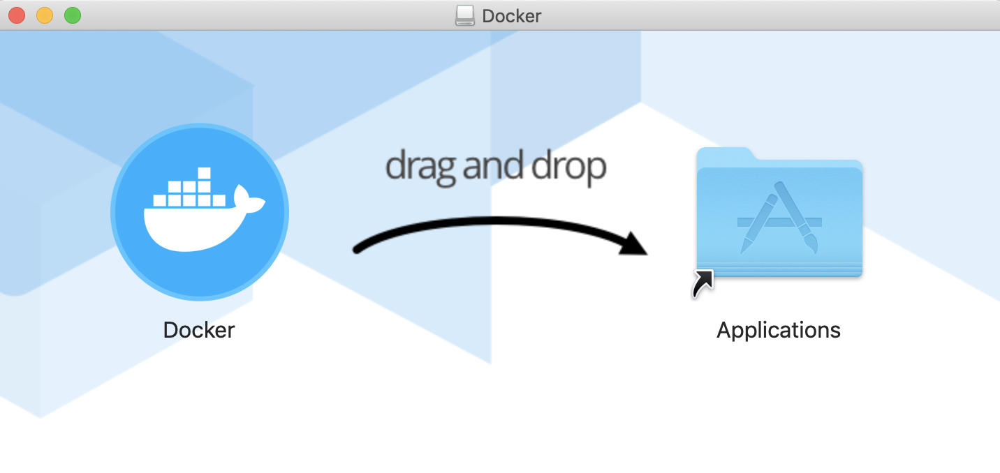

# Mac Developer SemanticBits

## Table of Contents

1. [Install Slack](#install-slack)
1. [Install 1Password](#install-1password)
1. [Create SSH key pair](#create-ssh-key-pair)
1. [Add ssh public key to your public GitHub profile](#add-ssh-public-key-to-your-public-github-profile)
1. [Verify SSH access to public GitHub using default SSH key pair](#verify-ssh-access-to-public-github-using-default-ssh-key-pair)
1. [Change ownership of HomeBrew related directories](#change-ownership-of-homebrew-related-directories)
1. [Install python3](#install-python3)
1. [Configure pip3](#configure-pip3)
1. [Install and configure Java](#install-and-configure-java)
   * [Uninstall any existing versions of Java](#uninstall-any-existing-versions-of-java)
   * [Install or verify Java SE Development Kit 13 (JDK13)](#install-or-verify-java-se-development-kit-13-jdk13)
   * [Configure JDK13](#configure-jdk13)
1. [Install and configure terminal tools](#install-and-configure-terminal-tools)
   * [Install or update p7zip](#install-or-update-p7zip)
   * [Install or update pwgen](#install-or-update-pwgen)
   * [Install or update telnet](#install-or-update-telnet)
   * [Install or update wget](#install-or-update-wget)
   * [Install or update maven](#install-or-update-maven)
   * [Install or update gnupg](#install-or-update-gnupg)
   * [Install or update tree](#install-or-update-tree)
   * [Install or update jsonpp](#install-or-update-jsonpp)
   * [Install or update htop](#install-or-update-htop)
   * [Install or update rpm](#install-or-update-rpm)
   * [Install or upgrade lua](#install-or-upgrade-lua)
   * [Install or update Emacs](#install-or-update-emacs)
   * [Install or update Node.js](#install-or-update-nodejs)
   * [Install or update jq](#install-or-update-jq)
1. [Install Packer](#install-packer)
1. [Install Terraform](#install-terraform)
1. [Install tflint](#install-tflint)
1. [Install flake8](#install-flake8)
1. [Install AWS CLI](#install-aws-cli)
1. [Install Docker Desktop on Mac](#install-docker-desktop-on-mac)
1. [Install ECS CLI](#install-ecs-cli)
1. [Install Xcode](#install-xcode)
1. [Install and configure Ruby](#install-and-configure-ruby)
1. [Install Keybase](#install-keybase)
1. [Install Postman](#install-postman)
1. [Install JMeter](#install-jmeter)
1. [Configure development CloudTamer credentials](#configure-development-cloudtamer-credentials)

## Install Slack

1. Open Chrome

1. Enter the following in the address bar

   > https://slack.com/downloads/mac

1. Select **Download**

1. Wait for the download to complete

1. Open a terminal

1. Run the Slack installer

   ```ShellSession
   $ open ~/Downloads/Slack*.dmg
   ```

1. Select and hold the **Slack** label under the Slack icon

1. Drag Slack to the **Applications** folder icon

1. Close the **Slack** window

1. Select the **Launchpad**

1. Select **Slack**

1. Select **Open**

1. Select **Sign In**

1. Note that a web page opens

1. Type the following in the **your-workspace-url** text box

   ```
   semanticbits
   ```

1. Select **Continue**

1. Select **Open Slack**

## Install 1Password

1. Open Chrome

1. Enter the following in the address bar

   > https://1password.com/downloads/mac

1. Select **Download 1Password...**

1. Wait for download to complete

1. Open 1Password package

   ```ShellSession
   $ open ~/Downloads/1Password*.pkg
   ```

1. Select **Continue** on the *This package will run...*

1. Select **Continue** on the *Introduction* window

1. Select **Install**

1. Select **Use Password**

1. Type Mac password in the **Password** text box

1. Select **Install Software**

1. Select **1Password.com** under *Used 1Password before*

1. Select **Scan your Setup Code**

1. Select **OK** on the "...access the camera" dialog

1. Open the "1Password Emergency Kit" document

   ```ShellSession
   $ open ~/software/1password/1Password*.pdf
   ```

1. Drag the "Scan your 1Password Setup Code" window so that the setup code image appears within the square

1. Enter the master password in the **Master Password** text box

1. Select **Sign In**

1. Check **Show 1Password in the menu bar**

1. Check **Open 1Password in the background when you log in**

1. Select **Next** on the *1Password, Always Available* window

1. Check **Use Touch ID to unlock 1Password**

1. Select **Let's Go!**

1. Select **Close** on the *Summary* window

1. Select **Move to Trash**

## Create SSH key pair

1. Make ".ssh" directory (if doesn't exist)

   ```ShellSession
   $ mkdir -p ~/.ssh
   ```
   
1. Change to the ".ssh" directory

   ```ShellSession
   $ cd ~/.ssh
   ```

1. Create the default SSH key
   
   ```ShellSesssion
   $ ssh-keygen -t rsa -b 4096
   ```

1. Press **enter** on the keyboard at the "Enter file in which to save the key" prompt

1. Press **enter** on the keyboard at the "Enter passphrase (empty for no passphrase)" prompt

1. Press **enter** on the keyboard at the "Enter same passphrase again" prompt

1. Note that the following default SSH keys have been created

   - ~/.ssh/id_rsa (default private key)

   - ~/.ssh/id_rsa.pub (default public key)

## Add ssh public key to your public GitHub profile
   
1. Open Chrome

1. Enter the following in the address bar

   > https://github.com/

1. Log on to GitHub (if not already logged in)

1. Select your profile icon on the upper right of the page

1. Select **Settings** from the profile dropdown

1. Select **SSH and GPG keys**

1. Select **New SSH Key**

1. Type a unique identifier in the **Title** text box

   *Example:*

   ```
   MacBook Pro (SemanticBits)
   ```

1. Copy your public key to the clipboard

   1. Open terminal

   1. Enter the following

      *Example:*
      
      ```ShellSession
      $ cat ~/.ssh/id_rsa.pub | pbcopy
      ```

1. Return to GitHub and paste the public key into the **Key** text box

1. Select **Add SSH Key**

## Verify SSH access to public GitHub using default SSH key pair

1. Open a terminal

1. Enter the following

   ```ShellSession
   $ ssh -T git@github.com
   ```

1. If an "Are you sure you want to continue connecting (yes/no)?" message appears, enter the following at the prompt:

   ```
   yes
   ```
   
1. Verify that the following message is returned

   *Format:*

   ```
   Hi {github account}! You've successfully authenticated, but GitHub does not provide shell access.
   ```

   *Example:*

   ```
   Hi fsmith! You've successfully authenticated, but GitHub does not provide shell access.
   ```

## Change ownership of HomeBrew related directories

1. Ensure that you have ownership of homebrew

   ```ShellSession
   $ sudo chown -R $(whoami) \
     /usr/local/var/homebrew \
     /usr/local/homebrew
   ```

1. Ensure that you have ownership of dependent directories

   ```ShellSession
   $ sudo chown -R $(whoami) \
     /usr/local/etc/bash_completion.d \
     /usr/local/lib/pkgconfig \
     /usr/local/share/aclocal \
     /usr/local/share/doc \
     /usr/local/share/man \
     /usr/local/share/man/man1 \
     /usr/local/share/man/man8 \
     /usr/local/share/zsh \
     /usr/local/share/zsh/site-functions
   ```

## Install python3

1. Determine if python3 is already installed

   ```ShellSession
   $ python3 --version
   ```
   
1. If python3 is not installed, do the following:

   ```ShellSession
   $ brew install python3
   ```

## Configure pip3

1. Upgrade pip3

   *Ignore the incompatible warnings.*
   
   ```ShellSession
   $ pip3 install --upgrade pip
   ```

1. Install lxml

   *Note that "lxml" is a library for parsing XML and HTML.*
   
   ```ShellSession
   $ pip3 install lxml
   ```

1. Install requests

   ```ShellSession
   $ pip3 install requests
   ```

1. Install boto3

   ```ShellSession
   $ pip3 install boto3
   ```

1. Install j2cli

   ```ShellSession
   $ pip3 install j2cli
   ```

## Install and configure Java

### Uninstall any existing versions of Java

1. Note how you are currently setting the JAVA_HOME environment variable for your terminal shell

   *Example of JAVA_HOME being set in .bash_profile, .zshrc, etc.:*
   
   ```
   export JAVA_HOME="$(/usr/libexec/java_home)"
   ```

1. If you currently setting the JAVA_HOME variable in a manner that differs from the above, change your existing JAVA_HOME line to match the following line

   ```
   export JAVA_HOME="$(/usr/libexec/java_home)"
   ```

1. If you are currently not setting JAVA_HOME, there are directions to do so in a later section

1. Determine if the current version of Java was installed with HomeBrew

   ```ShellSession
   $ brew cask list | grep adoptopenjdk
   ```

1. Note the output (if any)

   *Example:*
   
   ```
   adoptopenjdk12
   ```
   
1. If there was output, uninstall AdoptOpenJDK using HomeBrew

   *Format:*
   
   ```ShellSession
   $ brew cask remove adoptopenjdk{version}
   ```

   *Example:*
   
   ```ShellSession
   $ brew cask remove adoptopenjdk12
   ```

1. If you uninstalled the previous version of Java using HomeBrew, jump to the following section:

   [Install or verify Java SE Development Kit 13 (JDK13)](#install-or-verify-java-se-development-kit-13-jdk13)
   
1. If uninstalling an AdoptOpenJDK version that was installed as a Mac package, do the following:

   *Example for AdoptOpenJDK 8:*
   
   ```ShellSession
   $ sudo rm -rf /Library/Java/JavaVirtualMachines/adoptopenjdk-8.jdk
   $ sudo rm -f /private/var/db/receipts/net.adoptopenjdk.8.jdk.*
   ```

   *Example for AdoptOpenJDK 12:*
   
   ```ShellSession
   $ sudo rm -rf /Library/Java/JavaVirtualMachines/adoptopenjdk-12.jdk
   $ sudo rm -f /private/var/db/receipts/net.adoptopenjdk.12.jdk.*
   ```

1. If uninstalling a different version of Java, determine the method to uninstall and uninstall it

1. Close open terminals

1. Open a terminal

1. Ignore the following errors in the output

   ```
   Unable to find any JVMs matching version "(null)".
   No Java runtime present, try --request to install.
   ```

### Install or verify Java SE Development Kit 13 (JDK13)

1. Install Java SE Development Kit 13 (JDK13) using HomeBrew

   ```ShellSession
   $ brew tap AdoptOpenJDK/openjdk
   $ brew cask install adoptopenjdk13
   ```

1. Close all open terminals

1. Open a terminal

1. Note that there is no longer a "JVMs" error message

1. Verify Java by checking the version

   ```ShellSession
   $ java -version
   ```
  
### Configure JDK13

1. Set java environment variable
  
   1. Determine if you already have a "JAVA_HOME" variable

      ```ShellSession
      $ echo $JAVA_HOME
      ```

   1. If the output of the previous command was blank, do the following:

      1. Create or open the profile file for your terminal shell

         > Choose the option that matches your shell
  
         *Option #1: the default Mac bash shell with a "$" prompt*

         ```ShellSession
         $ vim ~/.bash_profile
         ```

         *Option #2: ZSH shell with a "%" prompt*
    
         ```ShellSession
         $ vim ~/.zshrc
         ```

         *Option #3: ???*

         > Open the profile file for your shell.
    
      1. Add the following text at the end of your profile file:
   
         ```
         # Set JAVA_HOME environment variable
         export JAVA_HOME="$(/usr/libexec/java_home)"
         ```  
  
      1. Save and close the file
    
      1. Close the terminal window

      1. Reopen the terminal window
  
         > The JAVA_HOME environment variable should now be set within the terminal.

      1. Verify that the "JAVA_HOME" variable is now dispayed

         ```ShellSession
         $ echo $JAVA_HOME
         ```

1. Check java version

   1. Enter the following

      ```ShellSession
      $ java -version
      ```

   1. Note the output

      *Example:*
      
      ```
      openjdk version "13.0.1" 2019-07-16
      OpenJDK Runtime Environment AdoptOpenJDK (build 13.0.1+10)
      OpenJDK 64-Bit Server VM AdoptOpenJDK (build 13.0.1+10, mixed mode, sharing)
      ```

## Install and configure terminal tools

### Install or update p7zip

1. Enter the following
   
   ```ShellSession
   $ brew install p7zip
   ```

2. If there is an "Error" beside "p7zip" in the output, do an upgrade:

   ```ShellSession
   $ brew upgrade p7zip
   ```

### Install or update pwgen

1. Enter the following
   
   ```ShellSession
   $ brew install pwgen
   ```

2. If there is an "Error" beside "pwgen" in the output, do an upgrade:

   ```ShellSession
   $ brew upgrade pwgen
   ```

3. Note that you can use pwgen to produce a selection of acceptable active directory passwords (for example) by doing the following

   ```
   $ pwgen -sy 12
   ```

### Install or update telnet

1. Enter the following
   
   ```ShellSession
   $ brew install telnet
   ```

2. If there is an "Error" beside "telnet" in the output, do an upgrade:

   ```ShellSession
   $ brew upgrade telnet
   ```

### Install or update wget

1. Enter the following
   
   ```ShellSession
   $ brew install wget
   ```

2. If there is an "Error" beside "wget" in the output, do an upgrade:

   ```ShellSession
   $ brew upgrade wget
   ```

### Install or update maven

1. Install maven

   ```ShellSession
   $ brew install maven
   ```

2. If there is an "Error" beside "maven" in the output, do an upgrade:

   ```ShellSession
   $ brew upgrade maven
   ```

### Install or update gnupg

1. Install gnupg

   ```ShellSession
   $ brew install gnupg
   ```

2. If there is an "Error" beside "gnupg" in the output, do an upgrade:

   ```ShellSession
   $ brew upgrade gnupg
   ```

### Install or update tree

1. Install tree

   ```ShellSession
   $ brew install tree
   ```

2. If there is an "Error" beside "tree" in the output, do an upgrade:

   ```ShellSession
   $ brew upgrade tree
   ```

### Install or update jsonpp

1. Install jsonpp

   ```ShellSession
   $ brew install jsonpp
   ```

2. If there is an "Error" beside "jsonpp" in the output, do an upgrade:

   ```ShellSession
   $ brew upgrade jsonpp
   ```

### Install or update htop

1. Install htop

   ```ShellSession
   $ brew install htop
   ```

2. If there is an "Error" beside "htop" in the output, do an upgrade:

   ```ShellSession
   $ brew upgrade htop
   ```

### Install or update rpm

1. Install rpm

   ```ShellSession
   $ brew install rpm
   ```

2. If there is an "Error" beside "rpm" in the output, do an upgrade:

   ```ShellSession
   $ brew upgrade rpm
   ```

### Install or upgrade lua

1. Install lua

   ```ShellSession
   $ brew install luarocks
   ```

2. If there is an "Error" beside "luarocks" in the output, do an upgrade:

   ```ShellSession
   $ brew upgrade luarocks
   ```
   
### Install or update Emacs

1. If you currently have Emacs open, close it

2. If you have an existing Emacs link in you dock, remove it

   *NOTE: If you don't remove it from the dock, it will still be pointing to the older vesion of Emacs. We will add the new version to the dock after the upgrade.*

   1. Right click on Emacs in the dock

   2. Select **Options**

   3. Select **Remove from Dock**

3. Delete the existing Emacs application link

   ```ShellSession
   $ rm -rf /Applications/Emacs.app
   ```

4. Uninstall existing Emacs

   *Ignore any errors.*
   
   ```ShellSession
   $ brew uninstall emacs
   $ brew uninstall emacs-plus
   $ brew cask uninstall emacs
   ```

5. Install Emacs by entering the following at the terminal prompt:

   *Note that this may take a while.*
   
   ```ShellSession
   $ brew cask install emacs
   ```
	
6. Configure Emacs

   1. Open Emacs
	  
      1. Select **Launchpad**
	 
      2. Select **Emacs**

   2. Select **Open** on the warning dialog
      
   3. If you want to keep Emacs in the dock, do the following

      1. Right click on the Emacs icon in the dock

      2. Select **Options**

      3. Select **Keep in Dock**

   4. Create a directory to save backup files by entering the following at the terminal prompt:
  
      > This prevents the tilde files from being saved to the same directory as the current file.
	  
      ```ShellSession
      $ mkdir -p ~/.saves
      ```

   5. Create or open your Emacs configuration file
   
      1. Enter the following within the Emacs editor

         ```
         control+X control+F
         ```

      2. Change the path at the **Find file** prompt to the following:

         ```
         ~/.emacs.d/init.el
         ```

      3. Press **return** on the keyboard
         
   6. Update your Emacs file with the following

      ```
      ;; Manage file backups
      (setq
        backup-by-copying t       ; don't clobber symlinks
        backup-directory-alist
          '(("." . "~/.saves/"))  ; don't litter my fs tree
        delete-old-versions t
        kept-new-versions 6
        kept-old-versions 2
        version-control t)        ; use versioned backups
  
      ;; Display full file path in title bar
      (setq frame-title-format
        '(:eval
          (if buffer-file-name
              (replace-regexp-in-string
               "\\\\" "/"
               (replace-regexp-in-string
                (regexp-quote (getenv "HOME")) "~"
                (convert-standard-filename buffer-file-name)))
            (buffer-name))))

      ;; Display the column number
      (setq column-number-mode t)
      ```
	  
   7. Save and close the file
      
   8. Close Emacs
	
      *Note that The configuration will take affect when you reopen Emacs.*

### Install or update Node.js

1. Install Node.js

   ```ShellSession
   $ brew install node
   ```

2. If there is an "Error" beside "node" in the output, do an upgrade:

   ```ShellSession
   $ brew upgrade node
   ```

## Install or update jq

1. Install jq using HomeBrew

   ```ShellSession
   $ brew install jq
   ```

2. Verify the jq installation by checking the version of jq

   ```ShellSession
   $ jq --version
   ```

## Install Packer

1. Install Packer using HomeBrew

   ```ShellSession
   $ brew install packer
   ```

2. Verify the packer installation by checking the version of packer

   ```ShellSession
   $ packer --version
   ```
   
## Install Terraform

1. Install Terraform 0.12

   ```ShellSession
   $ brew install terraform@0.12
   ```
   
2. Check the terraform version

   ```ShellSession
   $ terraform --version
   ```

## Install tflint

1. Note that "tflint" is a Terraform linter focused on possible errors, best practices, etc.

1. Install tflint

   ```ShellSession
   $ brew install tflint
   ```

1. Check the tflint version

   ```ShellSession
   $ tflint --version
   ```

## Install flake8

1. Note that "flake8" is a Python linter focused on possible errors, best practices, etc.

1. Install tflint

   ```ShellSession
   $ brew install flake8
   ```

1. Check the flake8 version

   ```ShellSession
   $ flake8 --version
   ```

## Install AWS CLI

### Determine if AWS CLI is installed

1. Check to see what version of AWS is installed (if any)

   ```ShellSession
   $ aws --version
   ```

1. If AWS CLI is not installed, jump to the following section

   [Install AWS CLI 2](#install-aws-cli-2)

1. If AWS CLI 1 is installed, jump to the following section

   [Uninstall AWS CLI 1](#uninstall-aws-cli-1)

1. If AWS CLI 2 is installed, jump to the following section

   [Install Docker Desktop on Mac](#install-docker-desktop-on-mac)

### Uninstall AWS CLI 1

1. Note the following:

   - AWS CLI 1 can be installed multiple ways

   - these instructions show how to uninstall AWS CLI 1 using pip3

   - these instructions may not work and may require another method to uninstall AWS CLI 1

1. Uninstall AWS CLI 1 using pip3

   ```ShellSession
   $ pip3 uninstall -y awscli
   ```

1. Backup the file that you use for setting up your shell's environment

   *Example for bash:*

   ```ShellSession
   $ cp ~/.bash_profile ~/.bash_profile_backup
   ```

1. Remove the existing AWS CLI lines from your shell's environment script

   1. Open your shell's environment script

      *Example for bash:*

      ```ShellSession
      $ vim ~/.bash_profile
      ```

   1. Delete the following lines from the script

      ```
      # Add AWS CLI to Path
      export PATH="$PATH:$HOME/Library/Python/3.7/bin"
      ```

   1. Save and close the file

### Install AWS CLI 2

1. Download the AWS CLI 2 package

   ```ShellSession
   $ cd ~/Downloads
   $ curl "https://awscli.amazonaws.com/AWSCLIV2.pkg" -o "AWSCLIV2.pkg"
   ```

1. Install AWS CLI 2

   ```ShellSession
   $ sudo installer -pkg AWSCLIV2.pkg -target /
   ```

1. Verify where AWS CLI 2 was installed

   1. Enter the following

      ```ShellSession
      $ which aws
      ```

   1. Verify that the following was displayed

      ```
      /usr/local/bin/aws
      ```

1. Verify the version of AWS CLI 2

   1. Enter the following

      ```ShellSession
      $ aws --version
      ```

   1. Note the output

      *Example:*

      ```
      aws-cli/2.0.31 Python/3.7.4 Darwin/18.7.0 botocore/2.0.0dev35
      ```

## Install Docker Desktop on Mac

1. If you have an existing version of Docker, do the following:

   1. Open Finder

   1. Select **Applications** in the leftmost panel

   1. Right click on the **Docker** file with the  icon

   1. Select **Move to Trash** from the contest menu
   
1. Open Chrome

1. Enter the following in the address bar

   > https://docs.docker.com/docker-for-mac/install

1. Select **Download from Docker Hub**

1. If prompted, log on to docker hub

1. Select **Download Docker Desktop for Mac**

1. Wait for download to complete

1. Open the downloaded file

   ```
   Docker.dmg
   ```

1. Wait for the following window to appear

   

1. Drag "Docker" icon to "Applications" icon

1. Wait for the installation to complete

1. Select **Launchpad**

1. Select **Docker**

1. Select **Open** on the "Are you sure..." dialog

1. Select **OK** on the "Docker Desktop needs privileged access" dialog

1. If prompted, enter Mac password

1. Wait for the "Docker Desktop is now up and running" message to appear in the docker top right system bar window

1. Close the docker top right system bar window

## Install ECS CLI

1. Download the Amazon ECS CLI binary

   ```ShellSession
   $ sudo curl -o /usr/local/bin/ecs-cli https://amazon-ecs-cli.s3.amazonaws.com/ecs-cli-darwin-amd64-latest
   ```

1. Verify the Amazon ECS CLI using the MD5 Sum

   1. Enter the following
   
      ```ShellSession
      $ curl -s https://amazon-ecs-cli.s3.amazonaws.com/ecs-cli-darwin-amd64-latest.md5 && md5 -q /usr/local/bin/ecs-cli
      ```

   2. Verify that the two output strings match

1. Apply Execute Permissions to the Binary

   ```ShellSession
   $ sudo chmod +x /usr/local/bin/ecs-cli
   ```

1. Check the version of the ECS CLI in order to verify that it is working

   ```ShellSession
   $ ecs-cli --version
   ```

## Install Xcode

1. Note that this installation can take a while

1. Select **Launchpad**

1. Select **App Store**

1. Enter the following in the **Search** text box

   ```
   xcode
   ```

1. Install Xcode

1. Wait for the Xcode installation to complete

1. Agree to Xcode license by doing the following:

   1. Select the **Launchpad** icon
  
   1. Select **Xcode**
  
   1. Select **Agree**
  
   1. Enter you machine password
  
   1. Wait for installation to complete

   1. Select the **Xcode** menu

   1. Select **Preferences**
   
   1. Select **Locations**

   1. Select the following from the **Command Line Tools** dropdown

      *Format:*

      ```
      Xcode {version}
      ```

   1. Enter you machine password
  
   1. Close Xcode

## Install and configure Ruby

1. Install rbenv

   ```ShellSession
   $ brew install rbenv
   ```

1. Note that the following dependencies are automatically installed

   - autoconf

   - ruby-build

1. Note the following caveats

   ```
   ==> autoconf
   Emacs Lisp files have been installed to:
     /usr/local/share/emacs/site-lisp/autoconf
   ```

1. Note that you can the determine that latest stable version of Ruby available via rbenv by doing the following

   ```ShellSession
   $ rbenv install -l | grep -v - | tail -1
   ```

1. Note that the latest stable version at the time of this writing was the following

   ```
   2.6.5
   ```

1. Install desired version of Ruby

   *Example installing Ruby 2.6.5:*
   
   ```ShellSession
   $ rbenv install 2.6.5
   ```

1. Wait for the installation to complete

   *Note that the installation will take a while. Be patient.*
   
1. Set the global version of Ruby

   *Example setting global version to Ruby 2.6.5:*

   ```ShellSession
   $ rbenv global 2.6.5
   ```

1. Backup the file that you use for setting up your shell's environment

   *Example for bash:*

   ```ShellSession
   $ cp ~/.bash_profile ~/.bash_profile_backup
   ```

1. Open the file that you use for setting up your shell's environment

   *Example if you are using the bash shell:*

   ```ShellSession
   $ vim ~/.bash_profile
   ```

1. Add the following to the end of the file

   ```
   # Setup rbenv
   if [[ -n `type rbenv | grep -v 'not found'` ]]; then
     eval "$(rbenv init -)"
   fi
   ```

1. Save and close the file

1. Close all open terminals

1. Reopen the terminal

1. Verify the Ruby version

   ```ShellSession
   $ ruby --version
   ```

1. Install Bundler

   ```ShellSession
   $ gem install bundler
   ```

1. Update Ruby Gems

   ```ShellSession
   $ gem update --system
   ```

1. Install Jekyll

   ```ShellSession
   $ gem install jekyll
   ```

## Install Keybase

1. Open Chrome

1. Enter the following in the address bar

   > https://keybase.io

1. Select **Install**

1. Select **macOS** from the leftmost panel

1. Select **Download and open Keybase.dmg** within the "Keybase on macOS" page

1. Wait for the download to complete

1. Open the downloaded file

   ```
   Keybase.dmg
   ```

1. Drag the **Keybase** icon label to the **Applications** icon when the "Keybase App" page appears

1. Wait for Keybase to finish copying

1. Open Launchpad

1. Selet **Keybase**

1. Select **Open** on the "Keybase is an app downloaded from the internet" warning dialog

1. If you are new to Keybase, do the following:

   1. Select **Create an account** and complete the account setup process

   1. Jump to the following section

      [Install Postman](#install-postman)

1. If you already have a Keybase account, do the following:

   1. Select **Login**

   1. Select an existing device that you previously registered with Keybase to use as authorization for your work Mac
   
   1. Select a device name like the following
   
      *Note that device name should be between 3 and 64 characters and use only a-Z, 0-9, space, undersore, dash, and apostrophe*
   
      *Example:*
      
      ```
      Work SemanticBits MacBook Pro Retina 15-inch Mid 2015
      ```
   
   1. Select **Continue**

   1. Notice that an 8-word secret will be displayed
   
   1. Open Keybase on the device that you are using for authorization
   
   1. Select the **Devices** icon in the leftmost panel

   1. Select **Add a device or paper key**

   1. Select **Add a computer**

   1. Type the 8-word secret in the "Type the 8-word secret code" text box

   1. Select **Continue**

## Install Postman

1. Open Chrome

1. Enter the following in the address bar

   > https://www.getpostman.com/downloads

1. Select **Download**

1. Wait fo the download to complete

1. Open a terminal

1. Enter the following

   ```ShellSession
   $ cd ~/Downloads
   $ 7z x Postman-osx-*.zip
   $ mv Postman.app /Applications
   ```

1. Select **Launchpad**

1. Select **Postman**

1. Verify that "Postman" opens

1. Select **Skip signing in and take me straight to the app** at the bottom of the page

1. Close **Postman**

## Install JMeter

1. Open Chrome

1. Enter the following in the address bar

   > https://archive.apache.org/dist/jmeter/binaries

1. Select the following

   ```
   apache-jmeter-5.2.1.tgz
   ```

1. Wait for the download to complete

1. Extract to the "/tmp" directory

   ```ShellSession
   $ tar xvzf ~/Downloads/apache-jmeter*.tgz -C /tmp
   ```

1. Move the extracted directory to the "/opt" directory

   ```ShellSession
   $ sudo mv /tmp/apache-jmeter* /opt/apache-jmeter
   ```

1. Create a symlink to the jmeter binary

   ```ShellSession
   $ sudo ln -s /opt/apache-jmeter/bin/jmeter /usr/local/bin/jmeter
   ```

1. Backup the file that you use for setting up your shell's environment

   *Example for bash:*

   ```ShellSession
   $ cp ~/.bash_profile ~/.bash_profile_backup
   ```

1. Add jmeter path to the file that you use for setting up your shell's environment

   *Example for bash:*

   ```ShellSession
   $ printf '\n# Add jmeter home variable' >> ~/.bash_profile
   $ printf '\nexport AB2D_JMETER_HOME="/opt/apache-jmeter"' >> ~/.bash_profile
   ```

1. Add jmeter path to the file that you use for setting up your shell's environment

   *Example for bash:*

   ```ShellSession
   $ printf '\n# Add jmeter to Path' >> ~/.bash_profile
   $ printf '\nexport PATH="$PATH:$AB2D_JMETER_HOME/bin"' >> ~/.bash_profile
   ```

1. Apply "bash_profile" changes now

   ```ShellSession
   $ source ~/.bash_profile
   ```

1. Verify jmeter by checking its version

   ```ShellSession
   $ jmeter --version
   ```

## Configure development CloudTamer credentials

1. Backup the file that you use for setting up your shell's environment

   *Example for bash:*

   ```ShellSession
   $ cp ~/.bash_profile ~/.bash_profile_backup
   ```

1. Set CloudTamer user name

   *Format:*

   ```ShellSession
   TEMP_CLOUDTAMER_USER_NAME={your eua id}
   TEMP_CLOUDTAMER_PASSWORD={your cloudtamer password}
   ```

1. Add development CloudTamer credentials to your interactive shell script

   *Example for bash:*

   ```ShellSession
   $ printf '\n# Set development CloudTamer credentials' >> ~/.bash_profile
   $ printf "\nexport CLOUDTAMER_USER_NAME=\"$TEMP_CLOUDTAMER_USER_NAME\"" >> ~/.bash_profile
   $ printf "\nexport CLOUDTAMER_PASSWORD=\"$TEMP_CLOUDTAMER_PASSWORD\"" >> ~/.bash_profile
   ```

1. Load updated profile in the current terminal

   ```ShellSession
   $ source ~/.bash_profile
   ```

1. Verify development CloudTamer credentials have been set 

   ```ShellSession
   $ echo "${CLOUDTAMER_USER_NAME}"
   $ echo "${CLOUDTAMER_PASSWORD}"
   ```
