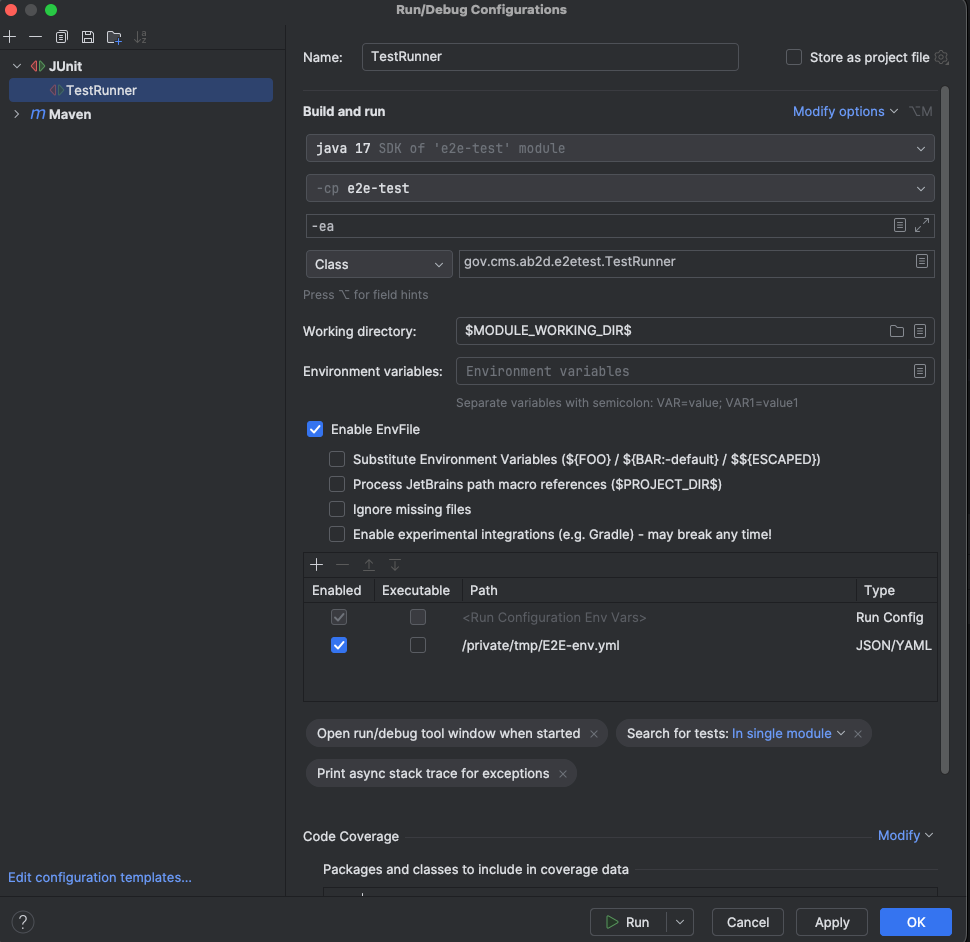

# Running E2E tests locally in IntelliJ

## Create env YAML file

Create the following YAML file and populate values from AWS parameter store.  

```
E2E_ENVIRONMENT: DEV
AB2D_BFD_URL: https://prod-sbx.fhir.bfd.cmscloud.local
OKTA_CLIENT_ID: ...
OKTA_CLIENT_PASSWORD: ...
SECONDARY_USER_OKTA_CLIENT_ID: ...
SECONDARY_USER_OKTA_CLIENT_PASSWORD: ...
AB2D_V2_ENABLED: 'true'
AB2D_V3_ENABLED: 'true'
AB2D_V3_ONLY: 'true'
AB2D_BFD_KEYSTORE_PASSWORD: ...
AB2D_BFD_KEYSTORE_LOCATION: / # ignored -- replaced by base64 keystore below
AB2D_BFD_KEYSTORE_BASE64: ...
AB2D_BFD_TRUSTSTORE_CERT: | 
  -----BEGIN CERTIFICATE-----
  ...
  -----END CERTIFICATE-----
AB2D_BFD_V3_TRUSTSTORE_CERT: |
  -----BEGIN CERTIFICATE-----
  ...
  -----END CERTIFICATE-----
```

## Install EnvFile plugin

The `EnvFile` plugin is needed in order to configure multi-line environment variables in IntelliJ. 

https://plugins.jetbrains.com/plugin/7861-envfile


## Update run configuration

In the `TestRunner` run configuration, check _Enable EnvFile_ and link the YAML config file:  


