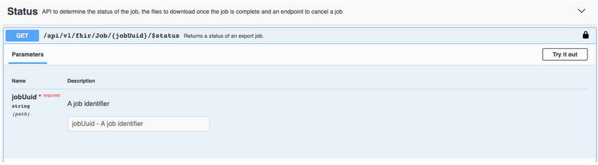

# Postman Instructions

##### Sandbox and the Onboarding Process

After attesting and electing an AB2D Data Operations Specialist (ADOS), a PDP organization must demonstrate their ability to use the API to access Production by successfully retrieving synthetic claims data from the test (Sandbox) environment. In order to verify this requirement, PDP organizations must provide the AB2D team with the Job ID from  a successful run in the test (Sandbox) environment.

##### What does this instruction guide contain?

These instructions will guide you through the process of obtaining a JSON web token (JWT), also referred to as a bearer token, using Postman. Postman offers a Graphical User Interface (GUI) and provides an easy entrance point for users. Once complete, this token will be used to pull synthetic claims data by accessing test (Sandbox) API endpoints using another application called Swagger. The instructions below: Postman (Step 1) + Swagger (Step 2) are needed to access the Sandbox environment. 

#### Step 1:  Postman Instructions

The Postman directions below are broken up into the following sections: 
- Downloading Postman
- Creating a new collection
- Saving a request
- Posting a request

##### Downloading Postman

Go to the Postman site [here](https://www.postman.com/downloads/) to download and install the app version of Postman. Because only the app version of Postman is allowed in Production, we promote the use of this version in Sandbox as well. The web version is available to you in Sandbox, but it will not be in Production. The directions below follow along with the app version of Postman.

You will then be directed to an account sign-in page. Note, you are able to directly access the app and skip sign-in by clicking the link at the bottom of the page as shown below. 

##### Creating a new collection
Click on the orange **+ New** button in the top left corner of the app.

Choose **Create New** to create a new Collection:  
  

Configure as follows:  
Name: **ab2d**  
Choose: **Create.**  
  

In the left hand panel, click on the three dot’s next the ab2d node you just created and choose **Add Request:**  

##### Saving a request
Configure the “SAVE REQUEST” page as follows:
- Request name: **retrieve-a-token**
- Select: **Save to ab2d** at bottom right corner.

##### Posting a request
Click on **GET, retrieve-a-token** under the ab2d node and immediately, a new tab will appear to the right.  
  

Alter the **GET** request to a **POST** request:  
  

In the bar next to **POST** enter the following URL:  
https://test.idp.idm.cms.gov/oauth2/aus2r7y3gdaFMKBol297/v1/token  
  

Configure the Params tab as follows:  

<table class="ds-c-table">
<thead>
    <tr>
        <th>Key</th>
        <th>Value</th> 
    </tr>
</thead>
<tbody>
    <tr>
        <td>grant_type</td>
        <td>client_credentials</td>
    </tr>
    <tr>
        <td>scope</td>
        <td>clientCreds</td>
    </tr>
</tbody>
</table>  
 
  

Configure the Headers tab as follows:  
Choose one of the sample Base64-encoded credentials from a sample PDP Sponsor. This will be placed under the **Value** column by **Authorization**.  
 

<table class="ds-c-table">
  <thead>
      <tr>
          <th>PDP Sponsor</th>
          <th>Base64-encoded id: password</th>
      </tr>
  </thead>
  <tbody>
      <tr>
          <td>0oa2t0lsrdZw5uWRx297</td>
          <td>MG9hMnQwbHNyZFp3NXVXUngyOTc6SEhkdVdHNkxvZ0l2RElRdVdncDNabG85T1lNVmFsVHRINU9CY3VIdw==</td>
      </tr>
      <tr>
          <td>0lc65ErV8OmY297</td>
          <td>MG9hMnQwbGM2NUVyVjhPbVkyOTc6MUJsM0hHTzZlZ2xrWFVEdGpWanRvM0wtM0Mwb2ZmelRNazJxbHo5cg==</td>
      </tr>
      <tr>
          <td>0oa2t0lkicpxFGkGt297</td>
          <td>MG9hMnQwbGtpY3B4RkdrR3QyOTc6ZURwYW5KVHR3OTB2WTJ2aVlsWDRvMnJnVlJJUjR0RFJIMG1Xcjl2Tg==</td>
      </tr>
      <tr>
          <td>0oa2t0l6c1tQbTikz297</td>
          <td>nQwbDZjMXRRYlRpa3oyOTc6ODB6WC03R2VpTWlpQTZ6VmdoaXFZWkw4Mm9MQVdTeGhnZkJrZm8wVA==</td>
      </tr>
      <tr>
          <td>0oa2t0lm9qoAtJHqC297</td>
          <td>nQwbG05cW9BdEpIcUMyOTc6eWJSNjBKbXRjcFJ0NlNBZUxtdmJxNmwtM1lEUkNaUC1XTjFBdDZ0Xw==</td>
      </tr>
  </tbody>
</table>  
  
 

<table class="ds-c-table">
  <thead>
      <tr>
          <th>Key</th>
          <th>Value</th>
      </tr>
  </thead>
  <tbody>
      <tr>
          <td>Content-Type</td>
          <td>application/x-www-form-urlencoded</td>
      </tr>
      <tr>
          <td>Accept</td>
          <td>application/json</td>
      </tr>
      <tr>
          <td>Authorization</td>
          <td>Basic {Base64-encoded id:password}</td>
      </tr>
  </tbody>
</table>
 
  
Select **Send.**  

In the body below you should see a token type, expires in statement, an access token, and scope statement as shown below:  
  

You will use this bearer token, specified by the **access_token** value (in the next hour), to access Sandbox endpoints in Swagger, which we explain how to use below.

#### Step 2:  Swagger Instructions

The Swagger directions below are broken into the following sections:  
- Authorize your bearer token
- Export a Job ID
- Check the status of a job
- Download your Job ID 

##### Authorize a bearer token
First - you must access the AB2D Swagger site by going [here](https://sandbox.ab2d.cms.gov/swagger-ui/index.html). Click “authorize” in the top right corner.  
  

Use the bearer token (retrieved in the last 24 hours by you, and no other user) to authorize entry into the Sandbox endpoints. You will place this in the box under Value, adding the word **Bearer before the token.**  
  

Be sure to leave a space between the word **Bearer** and the actual bearer token. Also remove any quotes from the token itself. Click **Authorize**.
  

You will see the following message:  
  

Click Close to **close** the window.  

##### Export a Job ID
Open up the **Export** menu to view all possible endpoints:  
  

Choose **/api/v1/fhir/Patient/$export** to initiate a Part A & B bulk claim export job. Then choose to **Try it out** in the right hand corner.  
  

Under **Prefer** add **respond-async** and then click the big blue bar to **Execute.** 
  

In the responses, look at the first code provided under **Server response**. Below that are all the other possible responses. The correct response should be a **202**, which means **Accepted**. This means the job has been created.  
  

From the information provided in the response, copy the Job ID from within the status request. 
Format:  
*content-location: http://sandbox.ab2d.cms.gov/api/v1/fhir/Job/**{job id}**/$status*

Example:  
*content-location:*  
*http://sandbox.ab2d.cms.gov/api/v1/fhir/Job/afc222d1-a55b-403b-ad22-49f5aefec4b6/$status*  

##### Check the status of your job
While these are test jobs and most will run immediately, it is good practice to understand the steps associated with running a job, including checking its status.  

Click on the **Status** menu to view the status endpoints:  
  

Copy the Job ID from the Export step. Click on the **GET /api/v1/fhir/{jobUuid}/$status** endpoint, click **Try it out** and paste the Job ID into the box provided.  
  

Click on the big blue bar labeled **Execute**.  
  

In the responses, view the first value. This is the server response. There are two possible values, 202 or 200. If the response is 202, this means that the job is still in progress. It will give you an indication of the job progress from 1 to 100%.  

  

You will need to re-click on the Execute blue bar periodically until the status returns a 200. This means the job is done and the response will contain a list of files. These files can then be downloaded and contain the claim records for our sample job.  

##### Download your Job ID

Click on the **Download** menu in swagger. Select the **GET /api/v1/fhir/Job/{jobUuid}/file/{filename}** endpoint to download a file. Click **Try it out**. Enter the Job ID of the job you created and the file name, then press the **Execute** big blue bar.  
  

It might take a while for the file to be downloaded depending on how big the job is. The browser may even stop responding, but it will eventually respond. The **Server response** value should be a **200** and the **Response body** will contain the claims data. To download the data into a file, click on the Download button in the lower right corner. This will be saved as an ndjson (new line delimited JSON) file in your downloads. This data format will be identical to the production data. Only the Job ID from this file is needed - please send the Job ID to the AB2D team per the instructions emailed to your organizations assigned ADOS.  

  
  

# Questions?

Having issues or concerns - please get in touch.  
[ab2d@semanticbits.com](mailto:ab2d@semanticbits.com) - direct email  
[AB2D Google Group](https://groups.google.com/u/1/g/cms-ab2d-api) - join the conversation