

<section class="page-section py-5" role="main" id="Top">
    <a href="#Top" id="scroll-to-top">
        <i class="fas fa-chevron-up"></i>
    </a>
    

        

            

                

                    

                        Postman Instructions 
                    

                    

                        Sandbox and the Onboarding Process 
                    

                    

                        What does this instruction guide contain? 
                    

                    

                        Step 1: Postman Instructions 
                    

                    

                        Downloading Postman 
                    

                    

                        Creating a new collection 
                    

                    

                        Saving a request 
                    

                    

                        Posting a request 
                    

                    

                        Step 2: Swagger Instructions 
                    

                    

                        Authorize a bearer token 
                    

                    

                        Export a Job ID 
                    

                    

                        Check the status of your job 
                    

                    

                        Download your Job ID 
                    

                    

                        Questions? 
                    

                

            

            

                <h1 id="PostmanInstructions-content">Postman Instructions</h1>

                <h5 id="SandboxandtheOnboardingProcess-content">Sandbox and the Onboarding Process</h5>
                

                    After attesting and electing an AB2D Data Operations Specialist (ADOS), a PDP organization must
                    demonstrate their ability to use the API to access Production by successfully retrieving synthetic
                    claims data from the test (Sandbox) environment. In order to verify this requirement, PDP
                    organizations must provide the AB2D team with the Job ID from a successful run in the test (Sandbox)
                    environment.
                

                

                    AB2D provides four sample contracts that have been designed to provide synthetic data for testing purposes.
                

                

                    <b>Simple Datasets- Two Contracts</b>
                

                

                    This dataset provides contracts with a varying number of beneficiaries containing simple 
                    approximations of AB2D data. These contracts are ideal to test the stress of retrieving and 
                    downloading different sized data files. The data in these API payloads will not reflect the 
                    distribution of disease and demographic information you can expect from production data.
                

  
                <table class="ds-c-table">
                    <thead>
                        <tr>
                            <th>PDP Sponsor</th>
                            <th>Contract</th>
                            <th>Number of Benes</th>
                        </tr>
                    </thead>
                    <tbody>
                        <tr>
                            <td>PDP-100</td>
                            <td>Z0000</td>
                            <td>100</td>
                        </tr>
                        <tr>
                            <td>PDP-10000</td>
                            <td>Z0010</td>
                            <td>10,000</td>
                        </tr>
                    </tbody>
                </table>
                

                    <b>Advanced Datasets- Two Contracts</b>
                

                

                    This dataset provides contracts with sample data that is a more accurate representation of AB2D 
                    production data. They follow AB2D’s Bulk FHIR format and contain a more realistic distribution of 
                    disease and demographic information.
                

                <table class="ds-c-table">
                    <thead>
                        <tr>
                            <th>PDP Sponsor</th>
                            <th>Contract</th>
                            <th>Number of Benes</th>
                        </tr>
                    </thead>
                    <tbody>
                        <tr>
                            <td>PDP-1001</td>
                            <td>Z1001</td>
                            <td>600-800</td>
                        </tr>
                        <tr>
                            <td>PDP-10000</td>
                            <td>Z1002</td>
                            <td>600-800</td>
                        </tr>
                    </tbody>
                </table>
                <h5 id="Whatdoesthisinstructionguidecontain-content">What does this instruction guide contain?</h5>

                
These instructions will guide you through the process of obtaining a JSON web token (JWT), also
                    referred to as a bearer token, using Postman. Postman offers a Graphical User Interface (GUI) and
                    provides an easy entrance point for users. Once complete, this token will be used to pull synthetic
                    claims data by accessing test (Sandbox) API endpoints using another application called Swagger. The
                    instructions below: Postman (Step 1) + Swagger (Step 2) are needed to access the Sandbox
                    environment. 

                <h4 id="step1-content">Step 1: Postman Instructions</h4>
                
The Postman directions below are broken up into the following sections:

                <ul>
                    <li>Downloading Postman</li>
                    <li>Creating a new collection</li>
                    <li>Saving a request</li>
                    <li>Posting a request</li>
                </ul>

                <h5 id="DownloadingPostman-content">Downloading Postman</h5>

                

                    Go to the Postman site <a target="_blank" href="https://www.postman.com/downloads/">here</a> to
                    download and install the app
                    version of Postman. Because only the app version of Postman is allowed in Production, we promote the
                    use of this version in Sandbox as well. The web version is available to you in Sandbox, but it will
                    not
                    be in Production. The directions below follow along with the app version of Postman.
                

                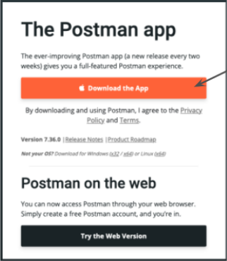

                
You will then be directed to an account sign-in page. Note, you are able to directly access the app
                    and
                    skip sign-in by clicking the link at the bottom of the page as shown below.
                

                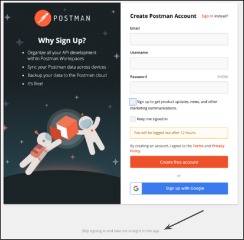

                <h5 id="Creatinganewcollection-content">Creating a new collection</h5>

                
Click on the orange <strong>+ New</strong> button in the top left corner of the app.

                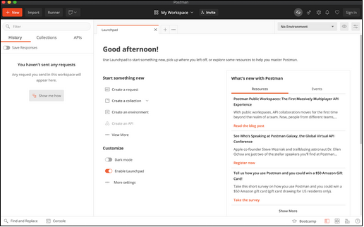

                
Choose <strong>Create New</strong> to create a new Collection:

                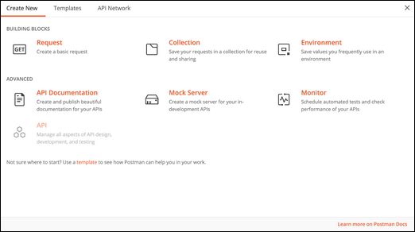

                

                    Configure as follows:  
                    Name: <strong>ab2d</strong>  
                    Choose: <strong>Create.</strong>  
                

                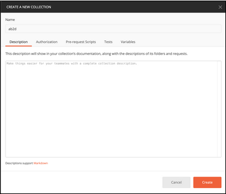

                
In the left hand panel, click on the three dot’s next the ab2d node you just created and choose
                    <strong>Add
                        Request:</strong>
                

                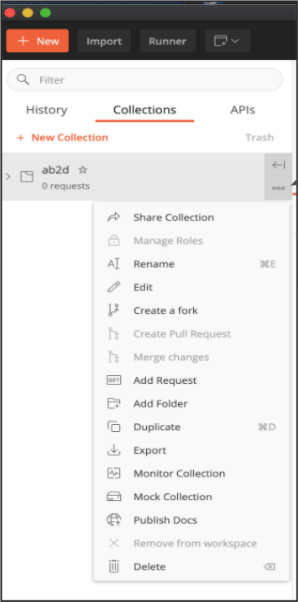

                <h5 id="Savingarequest-content">Saving a request</h5>
                
Configure the “SAVE REQUEST” page as follows:

                <ul>
                    <li>Request name: <strong>retrieve-a-token</strong></li>
                    <li>Select: <strong>Save to ab2d</strong> at bottom right corner.</li>
                </ul>

                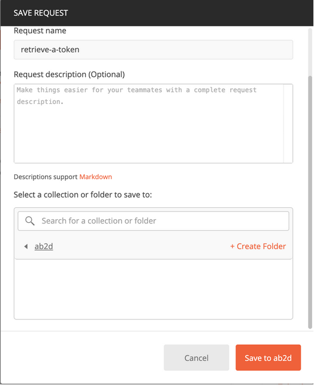

                <h5 id="Postingarequest-content">Posting a request</h5>

                
Click on <strong>GET, retrieve-a-token</strong> under the ab2d node and immediately, a new tab will
                    appear to the
                    right.

                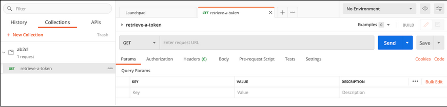

                
Alter the <strong>GET</strong> request to a <strong>POST</strong> request:

                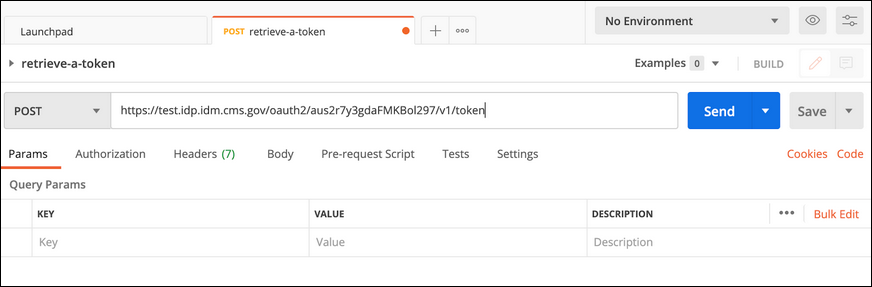

                

                    In the bar next to <strong>POST</strong> enter the following URL:  
                    https://test.idp.idm.cms.gov/oauth2/aus2r7y3gdaFMKBol297/v1/token
                

                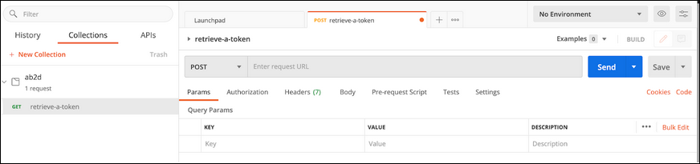

                
Configure the Params tab as follows:

                <table class="ds-c-table">
                    <thead>
                        <tr>
                            <th>Key</th>
                            <th>Value</th>
                        </tr>
                    </thead>
                    <tbody>
                        <tr>
                            <td>grant_type</td>
                            <td>client_credentials</td>
                        </tr>
                        <tr>
                            <td>scope</td>
                            <td>clientCreds</td>
                        </tr>
                    </tbody>
                </table>
                 

                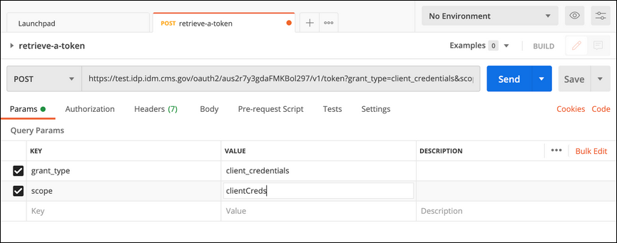

                

                    Configure the Headers tab as follows:  
                    Choose one of the sample Base64-encoded credentials from a sample PDP Sponsor. This will be placed
                    under
                    the <strong>Value</strong> column by <strong>Authorization</strong>.
                

                <table class="ds-c-table">
                    <thead>
                        <tr>
                            <th>PDP Sponsor</th>
                            <th>Base64-encoded id: password</th>
                        </tr>
                    </thead>
                    <tbody>
                        <tr>
                            <td>PDP-100</td>
                            <td>MG9hMnQwbHNyZFp3NXVXUngyOTc6SEhkdVdHNkxvZ0l2RElRdVdncDNabG85T1lNVmFsVHRINU9CY3VIdw==
                            </td>
                        </tr>
                        <tr>
                            <td>PDP-10000</td>
                            <td>MG9hMnQwbG05cW9BdEpIcUMyOTc6eWJSNjBKbXRjcFJ0NlNBZUxtdmJxNmwtM1lEUkNaUC1XTjFBdDZ0Xw==</td>
                        </tr>
                        <tr>
                            <td>PDP-1001 (Synthea)</td>
                            <td>MG9hOWp5eDJ3OVowQW50TEUyOTc6aHNrYlB1LVlvV2ZHRFkxZ2NRcTM0QmZJRXlNVnVheXU4N3pXRGxpRw==</td>
                        </tr>
                        <tr>
                            <td>PDP-1002 (Synthea)</td>
                            <td>MG9hOWp6MGUxZHlOZlJNbTYyOTc6c2huRzZOR2tIY3UyOXB0RHNLS1JXNnE1dUZKU1NwSXBkbF9LNWZWVw==</td>
                        </tr>
                    </tbody>
                </table>

                 

                <table class="ds-c-table">
                    <thead>
                        <tr>
                            <th>Key</th>
                            <th>Value</th>
                        </tr>
                    </thead>
                    <tbody>
                        <tr>
                            <td>Content-Type</td>
                            <td>application/x-www-form-urlencoded</td>
                        </tr>
                        <tr>
                            <td>Accept</td>
                            <td>application/json</td>
                        </tr>
                        <tr>
                            <td>Authorization</td>
                            <td>Basic {Base64-encoded id:password}</td>
                        </tr>
                    </tbody>
                </table>
                 

                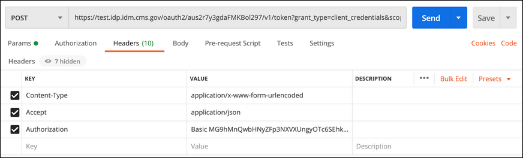
                

                    Select <strong>Send.</strong>  
                    In the body below you should see a token type, expires in statement, an access token, and scope
                    statement as shown below:
                

                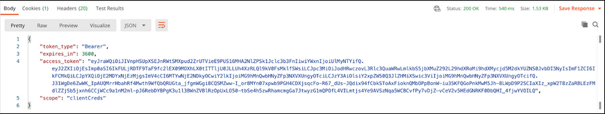

                

                    You will use this bearer token, specified by the <strong>access_token</strong> value (in the next
                    hour), to access
                    Sandbox endpoints in Swagger, which we explain how to use below.
                

                <h4 id="Step2-content">Step 2: Swagger Instructions</h4>

                
The Swagger directions below are broken into the following sections:

                <ul>
                    <li>Authorize your bearer token</li>
                    <li>Export a Job ID</li>
                    <li>Check the status of a job</li>
                    <li>Download your Job ID</li>
                </ul>

                <h5 id="Authorizeabearertoken-content">Authorize a bearer token</h5>
                
First - you must access the AB2D Swagger site by going <a target="_blank"
                        href="https://sandbox.ab2d.cms.gov/swagger-ui/index.html">here</a> Click
                    “authorize” in the top right corner.

                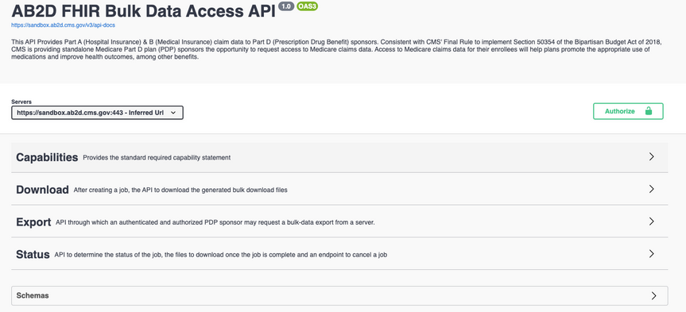

                

                    Use the bearer token (retrieved in the last 24 hours by you, and no other user) to authorize entry
                    into
                    the Sandbox endpoints. You will place this in the box under Value, adding the word <strong>Bearer
                        before the
                        token.</strong>
                

                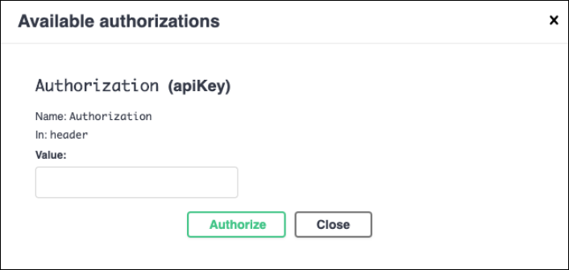

                
Be sure to leave a space between the word <strong>Bearer</strong> and the actual bearer token. Also
                    remove any quotes
                    from the token itself. Click <strong>Authorize</strong>.

                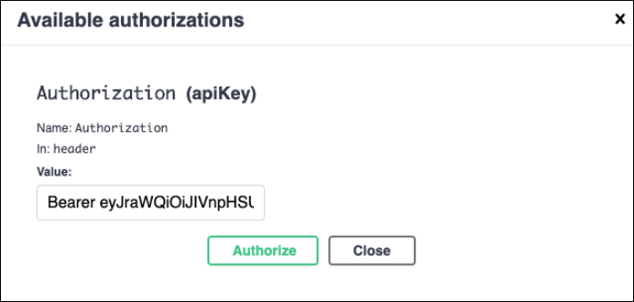

                
You will see the following message:

                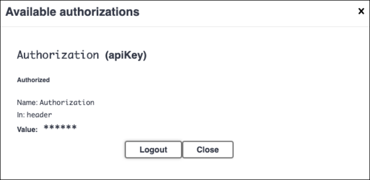

                
Click Close to <strong>close</strong> the window.

                <h5 id="ExportaJobID-content">Export a Job ID</h5>
                

                    Open up the <strong>Export</strong> menu to view all possible endpoints:
                

                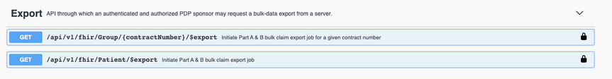

                
Choose <strong> /api/v1/fhir/Patient/$export</strong> to initiate a Part A & B bulk claim export job.
                    Then choose to
                    <strong>Try it out</strong> in the right hand corner.
                

                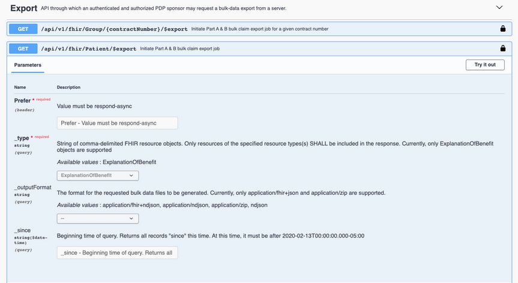

                
Under <strong>Prefer</strong> add <strong> respond-async</strong> and then click the big blue bar to
                    <strong> Execute.</strong>
                

                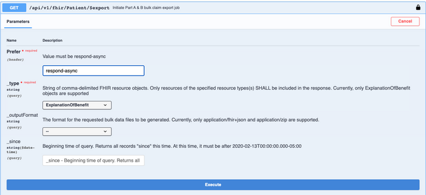

                
In the responses, look at the first code provided under <strong>Server response</strong>. Below that
                    are all the
                    other possible responses. The correct response should be a <strong>202</strong>, which means
                    <strong>Accepted</strong>. This means
                    the job has been created.
                

                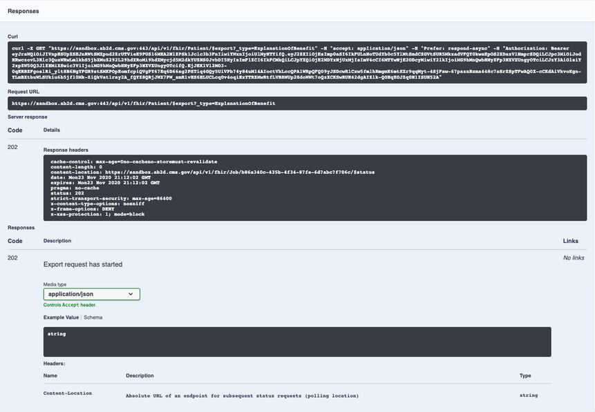

                

                    From the information provided in the response, copy the Job ID from within the status request.
                    Format:
                     
                    <em>content-location: http://sandbox.ab2d.cms.gov/api/v1/fhir/Job/<strong>{job
                            id}</strong>/$status</em>
                

                

                    Example:  
                    <em>content-location:</em>  
                    <em>http://sandbox.ab2d.cms.gov/api/v1/fhir/Job/afc222d1-a55b-403b-ad22-49f5aefec4b6/$status</em>
                

                <h5 id="Checkthestatusofyourjob-content">Check the status of your job</h5>

                
While these are test jobs and most will run immediately, it is good practice to understand the steps
                    associated with running a job, including checking its status.

                
Click on the <strong>Status</strong> menu to view the status endpoints:

                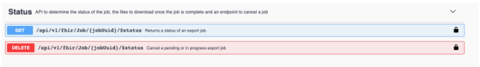

                
Copy the Job ID from the Export step. Click on the <strong>GET
                        /api/v1/fhir/{jobUuid}/$status</strong> endpoint,
                    click <strong>Try it out</strong> and paste the Job ID into the box provided.

                

                
Click on the big blue bar labeled <strong>Execute</strong>.

                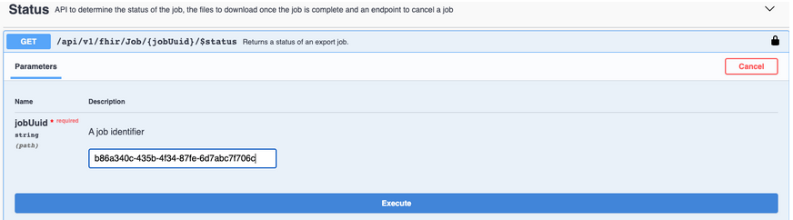

                

                    In the responses, view the first value. This is the server response. There are two possible values,
                    202
                    or 200. If the response is 202, this means that the job is still in progress. It will give you an
                    indication of the job progress from 1 to 100%.
                

                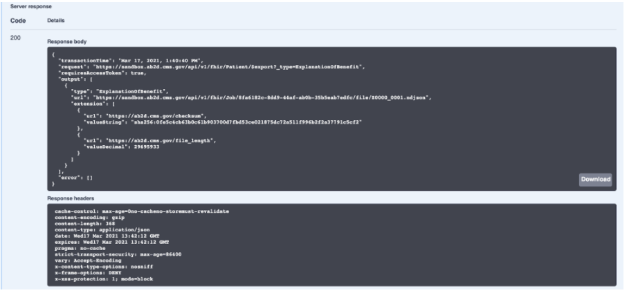

                
You will need to re-click on the Execute blue bar periodically until the status returns a 200. This
                    means the job is done and the response will contain a list of files. These files can then be
                    downloaded
                    and contain the claim records for our sample job.

                <h5 id="DownloadyourJobID-content">Download your Job ID</h5>

                
Click on the <strong>Download</strong> menu in swagger. Select the <strong>GET
                        /api/v1/fhir/Job/{jobUuid}/file/{filename}</strong>
                    endpoint to download a file. Click <strong>Try it out</strong>. Enter the Job ID of the job you
                    created and the file
                    name, then press the <strong>Execute</strong> big blue bar.

                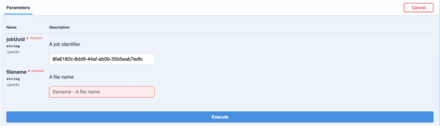

                

                    It might take a while for the file to be downloaded depending on how big the job is. The browser may
                    even stop responding, but it will eventually respond. The <strong>Server response</strong> value
                    should be a
                    <strong>200</strong>
                    and the <strong>Response body</strong> will contain the claims data. To download the data into a
                    file, click on
                    the
                    Download button in the lower right corner. This will be saved as an ndjson (new line delimited JSON)
                    file in your downloads. This data format will be identical to the production data. Only the Job ID
                    from
                    this file is needed - please send the Job ID to the AB2D team per the instructions emailed to your
                    organizations assigned ADOS.
                

                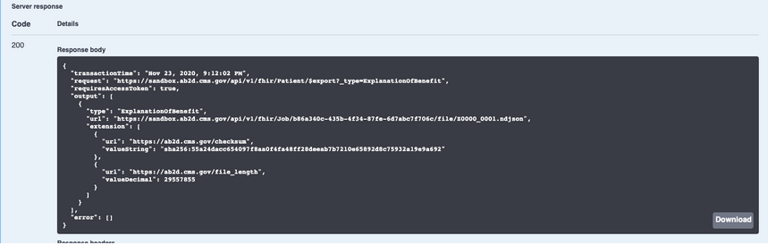
                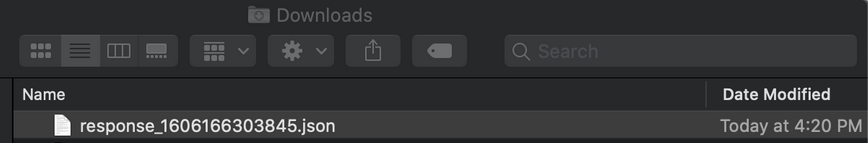

                <h1 id="Questions-content">Questions?</h1>
                

                    Having issues or concerns - please get in touch.  
                    <a href="mailto:ab2d@semanticbits.com">ab2d@semanticbits.com</a> - direct email  
                    <a href="https://groups.google.com/u/1/g/cms-ab2d-api">AB2D Google Group</a> - join the conversation
                

            

        

    

</section>